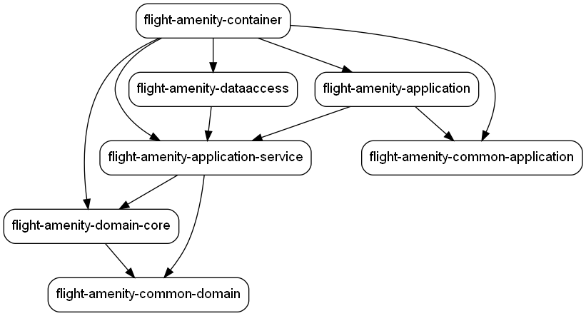
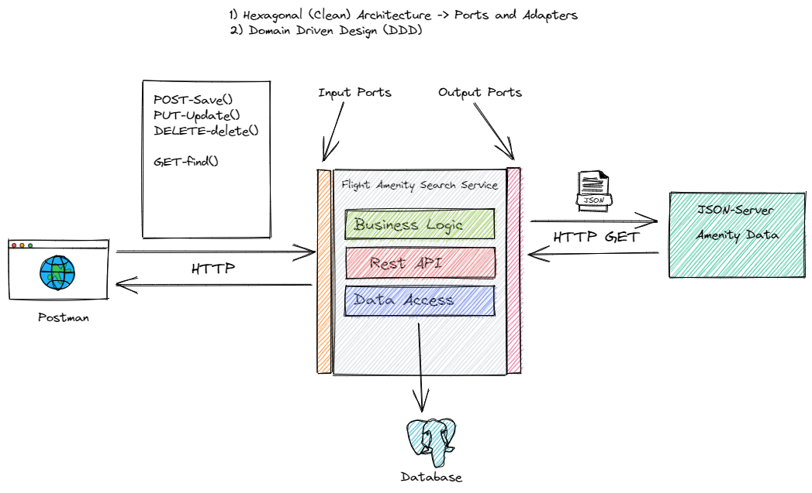

# flight-amenity-search-service

### JSON SERVER

>cd json-server

>docker run -d -p 8002:80 --name ammserver -v {AbsolutePathToJsonFile}:/data/db.json clue/json-server

Example

>docker run -d -p 8002:80 --name ammserver -v "C:/Users/N4427/Documents/Git Projects/flight-amenity-service/json-server/ammenities.json":/data/db.json clue/json-server 

### Dependency Graph

> mvn com.github.ferstl:depgraph-maven-plugin:aggregate -DcreateImage=true -DreduceEdges=false -Dscope=compile "-Dincludes=com.airretailer*:*"

### High-level Architecture

